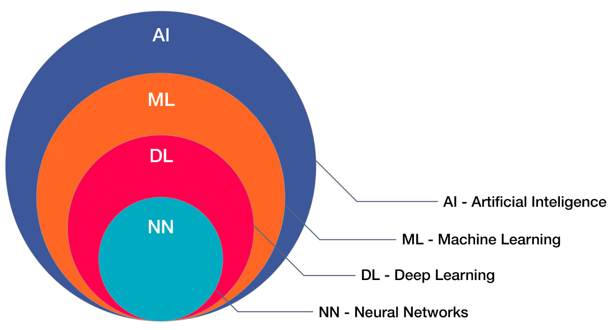
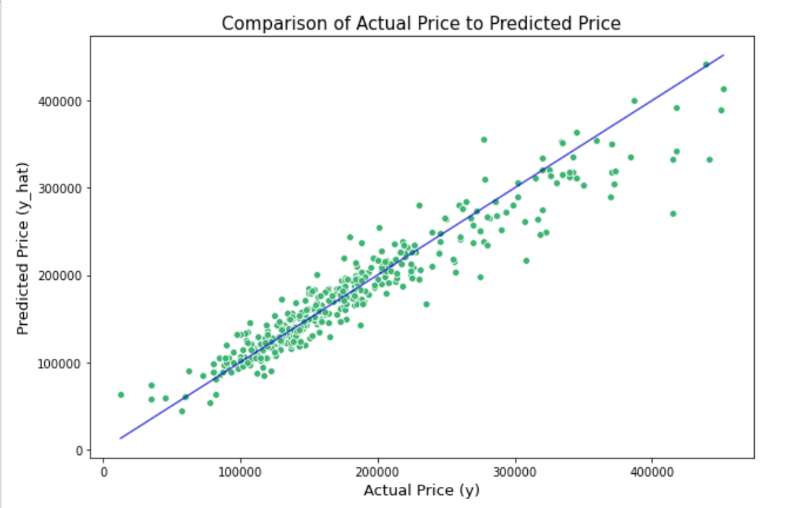
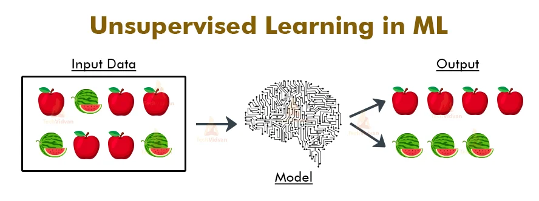
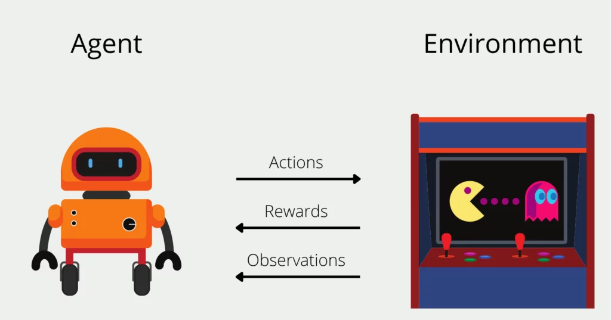
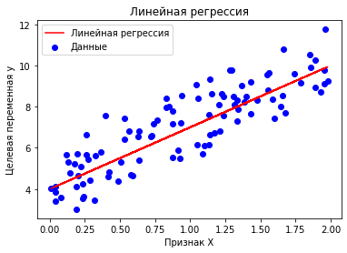
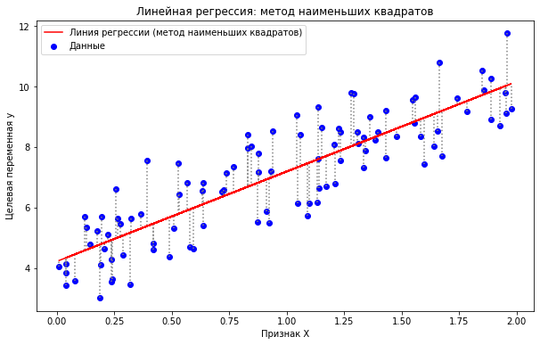
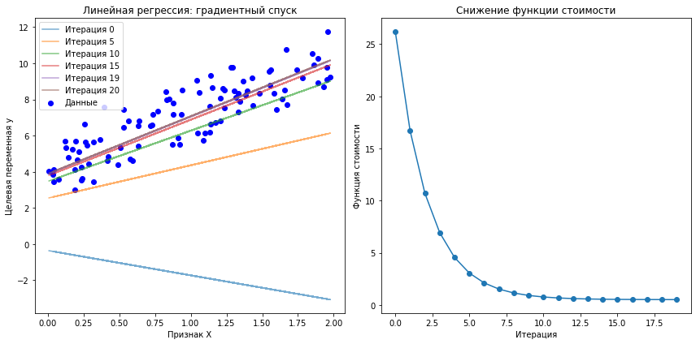
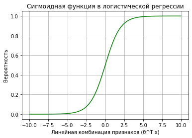
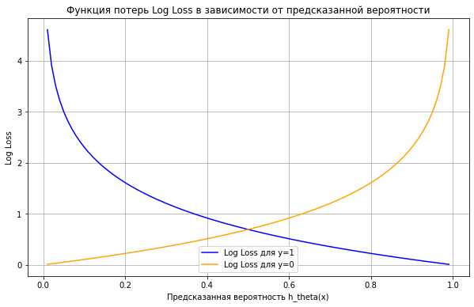
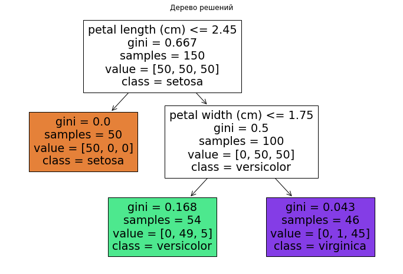

**Лекция: Введение в машинное обучение**

---

### **Содержание:**

1. **Вводная часть**
   - 1.1 Что такое машинное обучение?
   - 1.2 Искусственный интеллект и его связь с машинным обучением
2. **Классификация задач машинного обучения**
   - 2.1 Обучение с учителем (Supervised Learning)
   - 2.2 Обучение без учителя (Unsupervised Learning)
   - 2.3 Обучение с подкреплением (Reinforcement Learning)
3. **Линейная регрессия**
   - 3.1 Основы линейной регрессии
   - 3.2 Метод наименьших квадратов
   - 3.3 Градиентный спуск для линейной регрессии
4. **Логистическая регрессия**
   - 4.1 Основы логистической регрессии
   - 4.2 Функция потерь и максимальное правдоподобие
   - 4.3 Обучение модели
5. **Методы оптимизации**
   - 5.1 Градиентный спуск (Batch Gradient Descent)
   - 5.2 Стохастический градиентный спуск (SGD)
   - 5.3 RMSProp
   - 5.4 Adam
   - 5.5 Nesterov Momentum
6. **Деревья решений**
   - 6.1 Decision Tree
   - 6.2 Random Forest
   - 6.3 Boosting
   - 6.4 AdaBoost

---

### **1. Вводная часть**

#### **1.1 Что такое машинное обучение?**

**Определение:**
Машинное обучение (МО) — это область искусственного интеллекта, которая фокусируется на разработке алгоритмов и моделей, позволяющих компьютерам обучаться на основе данных и улучшать свои прогнозы или решения с течением времени без явного программирования для каждой конкретной задачи.

**Почему это важно?**
В современном мире объем данных растет экспоненциально. Машинное обучение предоставляет инструменты для анализа этих данных и извлечения из них полезной информации.

**Пример из жизни:**
Представьте, что вы хотите создать программу, которая распознает рукописные цифры. Традиционное программирование потребовало бы определения правил для каждого возможного написания цифры — задача практически невыполнимая. С помощью машинного обучения вы можете обучить модель на большом наборе изображений цифр и позволить ей самостоятельно выявить паттерны, характерные для каждой цифры.

#### **1.2 Искусственный интеллект и его связь с машинным обучением**

**Искусственный интеллект (ИИ):**
ИИ — это область компьютерных наук, направленная на создание систем, способных выполнять задачи, требующие человеческого интеллекта. Это включает в себя понимание естественного языка, распознавание образов, принятие решений и решение проблем.

**Связь с машинным обучением:**
Машинное обучение является подмножеством ИИ. Если ИИ — это цель создать "умные" системы, то машинное обучение — это один из способов достижения этой цели. МО предоставляет практические методы и алгоритмы, которые позволяют системам обучаться и адаптироваться на основе данных.



**Иерархия:**

- **Искусственный интеллект**
  - **Машинное обучение**
    - **Обучение с учителем**
    - **Обучение без учителя**
    - **Обучение с подкреплением**

---

### **2. Классификация задач машинного обучения**

Машинное обучение можно разделить на несколько категорий в зависимости от типа задачи и наличия размеченных данных.

#### **2.1 Обучение с учителем (Supervised Learning)**

**Описание:**
В обучении с учителем модель обучается на размеченных данных. Это означает, что для каждого входного примера известен соответствующий правильный выход.

**Цель:**
Научить модель предсказывать правильный выход для новых, ранее не виденных входных данных.

**Примеры задач:**

- **Классификация:** Определение, к какому классу принадлежит объект. Например, классификация писем на "спам" и "не спам".


- **Регрессия:** Предсказание непрерывного значения. Например, прогнозирование цены дома на основе его характеристик.


**Пример:**
У вас есть набор данных о недвижимости, где для каждого дома известны его характеристики (площадь, количество комнат и т.д.) и цена продажи. Вы хотите создать модель, которая будет предсказывать цену дома на основе его характеристик.

#### **2.2 Обучение без учителя (Unsupervised Learning)**



**Описание:**
В обучении без учителя модель обучается на неразмеченных данных. Модель пытается обнаружить скрытые структуры или паттерны в данных без предоставления правильных ответов.

**Цель:**
Выявить внутренние связи и структуры в данных.

[**Примеры задач:**](https://projector.tensorflow.org/)

- **Кластеризация:** Группировка похожих объектов вместе. Например, сегментация клиентов по поведению для таргетированного маркетинга.
- **Снижение размерности:** Уменьшение количества признаков в данных, сохраняя при этом важную информацию. Например, метод главных компонент (PCA).

**Пример:**
У вас есть данные о поведении пользователей на сайте, и вы хотите сегментировать пользователей на группы с похожими интересами для персонализации контента.

#### **2.3 Обучение с подкреплением (Reinforcement Learning)**

[Coast runner](https://www.youtube.com/watch?v=tlOIHko8ySg)

**Описание:**
В обучении с подкреплением агент взаимодействует с окружающей средой и учится принимать решения, получая вознаграждения или наказания за свои действия.



**Цель:**
Максимизировать суммарное вознаграждение за серию действий.

**Примеры задач:**

- Обучение робота ходьбе или манипуляции объектами.
- Разработка алгоритмов для игры в шахматы, го или других игр.

**Пример:**
Агент обучается играть в игру, получая положительное вознаграждение за победу и отрицательное за проигрыш. Со временем агент учится выбирать действия, которые увеличивают его шансы на победу.

---

### **3. Линейная регрессия**

Линейная регрессия — один из самых простых и популярных алгоритмов в машинном обучении, используемый для решения задач регрессии.

#### **3.1 Основы линейной регрессии**

```python
import numpy as np

# Случайные данные
np.random.seed(0)
X = 2 * np.random.rand(100, 1)
y = 4 + 3 * X + np.random.randn(100, 1)

# Линейная регрессия
theta_0, theta_1 = 4, 3  # истинные параметры
y_pred = theta_0 + theta_1 * X

plt.scatter(X, y, color="blue", label="Данные")
plt.plot(X, y_pred, color="red", label="Линейная регрессия")
plt.xlabel("Признак X")
plt.ylabel("Целевая переменная y")
plt.legend()
plt.title("Линейная регрессия")
plt.show()

```


**Цель:**
Моделировать линейную зависимость между входными переменными $X$ и выходной переменной $y$.

**Математическая модель:**

Для одного признака:
$$
y = \theta_0 + \theta_1 x
$$

Для нескольких признаков:
$$
y = \theta_0 + \theta_1 x_1 + \theta_2 x_2 + \dots + \theta_n x_n
$$

Где:

- $y$ — предсказываемая переменная (целевой признак).
- $x_i$ — входные признаки.
- $\theta_i$ — параметры модели (веса).

**Векторная форма:**
$$
y = \theta^T x
$$
Где:

- $\theta$ — вектор параметров $[ \theta_0, \theta_1, ..., \theta_n ]^T$.
- $x$ — вектор признаков $[ 1, x_1, x_2, ..., x_n ]^T$ (заметим, что мы добавляем 1 для учета свободного члена $\theta_0$).

**Интуиция:**
Линейная регрессия пытается найти такую прямую (или гиперплоскость в случае нескольких признаков), которая наилучшим образом описывает зависимость между входными признаками и выходной переменной.

#### **3.2 Метод наименьших квадратов**

```python
import numpy as np
import matplotlib.pyplot as plt

# Случайные данные
np.random.seed(0)
X = 2 * np.random.rand(100, 1)
y = 4 + 3 * X + np.random.randn(100, 1)

# Оценка коэффициентов линейной регрессии с использованием метода наименьших квадратов
X_b = np.c_[np.ones((100, 1)), X]  # добавляем столбец с единицами для свободного члена
theta_best = np.linalg.inv(X_b.T.dot(X_b)).dot(X_b.T).dot(y)

# Предсказание значений на основе рассчитанных коэффициентов
y_pred = X_b.dot(theta_best)

# Визуализация данных, линии регрессии и ошибок
plt.figure(figsize=(10, 6))
plt.scatter(X, y, color="blue", label="Данные")
plt.plot(X, y_pred, color="red", label="Линия регрессии (метод наименьших квадратов)")
plt.xlabel("Признак X")
plt.ylabel("Целевая переменная y")

# Добавляем вертикальные линии для отклонений
for i in range(len(X)):
    plt.vlines(X[i], y[i], y_pred[i], color="gray", linestyle="dotted")

plt.legend()
plt.title("Линейная регрессия: метод наименьших квадратов")
plt.show()
```


**Функция потерь (стоимости):**

Чтобы оценить, насколько хорошо модель предсказывает данные, используется функция стоимости $J(\theta)$:

$$
J(\theta) = \frac{1}{2m} \sum_{i=1}^{m} (h_\theta(x^{(i)}) - y^{(i)})^2
$$

Где:

- $m$ — количество обучающих примеров.
- $h_\theta(x^{(i)})$ — предсказание модели для $i$-го примера.
- $y^{(i)}$ — реальное значение для $i$-го примера.

**Цель:**
Найти такие параметры $\theta$, которые минимизируют функцию стоимости $J(\theta)$. Это означает, что мы ищем линию, при которой сумма квадратов отклонений предсказанных значений от реальных минимальна.

**Почему квадрат ошибок?**
Использование квадрата ошибки делает функцию потерь непрерывной и дифференцируемой, что упрощает процесс оптимизации.

#### **3.3 Градиентный спуск для линейной регрессии**

```python
import numpy as np
import matplotlib.pyplot as plt

# Генерация случайных данных
np.random.seed(0)
X = 2 * np.random.rand(100, 1)
y = 4 + 3 * X + np.random.randn(100, 1)

# Инициализация параметров для линейной регрессии
theta = np.random.randn(2, 1)  # случайные начальные значения для θ0 и θ1
learning_rate = 0.1
iterations = 20

# Добавление столбца единиц для X (для учета свободного члена θ0)
X_b = np.c_[np.ones((100, 1)), X]

# Функция для вычисления стоимости (сумма квадратов ошибок)
def compute_cost(X, y, theta):
    m = len(y)
    predictions = X.dot(theta)
    cost = (1 / (2 * m)) * np.sum((predictions - y) ** 2)
    return cost

# Градиентный спуск
cost_history = []  # для хранения значений функции стоимости
theta_history = [theta.copy()]  # для хранения значений θ на каждой итерации

for iteration in range(iterations):
    gradients = (1 / len(y)) * X_b.T.dot(X_b.dot(theta) - y)
    theta = theta - learning_rate * gradients
    cost_history.append(compute_cost(X_b, y, theta))
    theta_history.append(theta.copy())

# Визуализация изменения линии регрессии на каждом шаге
plt.figure(figsize=(12, 6))

# Подграфик 1: Линия регрессии на каждом шаге
plt.subplot(1, 2, 1)
plt.scatter(X, y, color="blue", label="Данные")
for i, theta in enumerate(theta_history):
    y_pred = X_b.dot(theta)
    if i % 5 == 0 or i == iterations - 1:  # показываем некоторые итерации и финальную
        plt.plot(X, y_pred, label=f"Итерация {i}", alpha=0.6)
plt.xlabel("Признак X")
plt.ylabel("Целевая переменная y")
plt.legend()
plt.title("Линейная регрессия: градиентный спуск")

# Подграфик 2: Функция стоимости по итерациям
plt.subplot(1, 2, 2)
plt.plot(range(len(cost_history)), cost_history, marker="o")
plt.xlabel("Итерация")
plt.ylabel("Функция стоимости")
plt.title("Снижение функции стоимости")

plt.tight_layout()
plt.show()
```


**Градиентный спуск — это итеративный алгоритм оптимизации для нахождения минимума функции.**

**Алгоритм:**

1. Инициализировать параметры $\theta$ (например, нулями или небольшими случайными значениями).
2. Повторять до сходимости:

   $$
   \theta_j := \theta_j - \alpha \frac{\partial J(\theta)}{\partial \theta_j}
   $$

   Где:

   - $\alpha$ — скорость обучения (learning rate), небольшой положительный гиперпараметр.
   - $\frac{\partial J(\theta)}{\partial \theta_j}$ — частная производная функции стоимости по параметру $\theta_j$.

**Вывод формулы обновления параметров:**

Для функции стоимости линейной регрессии частная производная вычисляется как:

$$
\frac{\partial J(\theta)}{\partial \theta_j} = \frac{1}{m} \sum_{i=1}^{m} (h_\theta(x^{(i)}) - y^{(i)}) x_j^{(i)}
$$

**Таким образом, обновление параметров принимает вид:**

$$
\theta_j := \theta_j - \alpha \frac{1}{m} \sum_{i=1}^{m} (h_\theta(x^{(i)}) - y^{(i)}) x_j^{(i)}
$$

**Интуиция:**

- Если предсказание модели $h_\theta(x^{(i)})$ больше, чем реальное значение $y^{(i)}$, то $\theta_j$ уменьшается.
- Если предсказание меньше реального значения, то $\theta_j$ увеличивается.
- Скорость изменения зависит от разницы между предсказанием и реальным значением, а также от значения признака $x_j^{(i)}$.

**Важные нюансы:**

- **Скорость обучения $\alpha$:** Если она слишком мала, алгоритм будет сходиться очень медленно. Если слишком велика, алгоритм может не сойтись и начать "скакать" вокруг минимума.
- **Нормализация признаков:** При наличии признаков с разными масштабами рекомендуется нормализовать их, чтобы ускорить сходимость.

---

### **4. Логистическая регрессия**

Логистическая регрессия используется для задач бинарной классификации, где целевая переменная принимает два возможных значения (например, "да" или "нет", "спам" или "не спам").

#### **4.1 Основы логистической регрессии**

**Проблема с линейной регрессией для классификации:**

- Линейная регрессия может предсказывать любые значения от $-\infty$ до $+\infty$, тогда как для классификации нам нужны вероятности в диапазоне от 0 до 1.

**Решение:**
Использовать **сигмоидную функцию** для преобразования линейной комбинации признаков в вероятность.

```python
def sigmoid(x):
    return 1 / (1 + np.exp(-x))

# График сигмоиды
x_vals = np.linspace(-10, 10, 100)
y_vals = sigmoid(x_vals)

plt.plot(x_vals, y_vals, color="green")
plt.xlabel("Линейная комбинация признаков (θ^T x)")
plt.ylabel("Вероятность")
plt.title("Сигмоидная функция в логистической регрессии")
plt.grid()
plt.show()
```


**Сигмоидная функция:**

$$
h_\theta(x) = \frac{1}{1 + e^{-\theta^T x}}
$$

- $h_\theta(x)$ интерпретируется как вероятность того, что $y = 1$ при заданном $x$.

**График сигмоидной функции:**

- При $\theta^T x = 0$, $h_\theta(x) = 0.5$.
- По мере увеличения $\theta^T x$, $h_\theta(x)$ стремится к 1.
- По мере уменьшения $\theta^T x$, $h_\theta(x)$ стремится к 0.

#### **4.2 Функция потерь и максимальное правдоподобие**

**Почему нельзя использовать функцию стоимости линейной регрессии?**

- Функция стоимости линейной регрессии (сумма квадратов ошибок) становится нелинейной и нелогичной для логистической регрессии.
  - Для бинарной классификации целевая переменная $y$ принимает значения 0 или 1. Если использовать линейную функцию для предсказания, предсказанные значения будут разными, но не интерпретируемыми как вероятности. Использование квадратичной функции стоимости также подразумевает, что отклонение $h_\theta(x) - y$ должно быть минимизировано, но это не приводит к эффективному обучению для классификационных задач, где важна вероятность принадлежности к классу.

**Логистическая функция стоимости (Log Loss):**

$$
J(\theta) = -\frac{1}{m} \sum_{i=1}^{m} \left[ y^{(i)} \log h_\theta(x^{(i)}) + (1 - y^{(i)}) \log (1 - h_\theta(x^{(i)})) \right]
$$

**Интуиция:**

- Если реальное значение $y^{(i)} = 1$, то в функцию стоимости входит только первый член: $-\log h_\theta(x^{(i)})$. Таким образом, если модель предсказывает вероятность близкую к 1, то функция стоимости будет мала.
- Если $y^{(i)} = 0$, то в функцию стоимости входит только второй член: $-\log (1 - h_\theta(x^{(i)}))$. Здесь мы хотим, чтобы $h_\theta(x^{(i)})$ было близко к 0.

```python
import numpy as np
import matplotlib.pyplot as plt

# Генерация значений вероятности от 0 до 1
h_theta = np.linspace(0.01, 0.99, 100)  # избегаем 0 и 1, чтобы избежать логарифмической ошибки

# Вычисление Log Loss для y = 1 и y = 0
log_loss_y1 = -np.log(h_theta)            # для случая y = 1
log_loss_y0 = -np.log(1 - h_theta)        # для случая y = 0

# Визуализация
plt.figure(figsize=(10, 6))
plt.plot(h_theta, log_loss_y1, label="Log Loss для y=1", color="blue")
plt.plot(h_theta, log_loss_y0, label="Log Loss для y=0", color="orange")
plt.xlabel("Предсказанная вероятность h_theta(x)")
plt.ylabel("Log Loss")
plt.title("Функция потерь Log Loss в зависимости от предсказанной вероятности")
plt.legend()
plt.grid(True)
plt.show()
```


**Цель:**
Минимизировать функцию стоимости $J(\theta)$, что эквивалентно максимизации правдоподобия данных.

Конечно, вот более подробный вывод градиента функции стоимости для логистической регрессии, включая расчеты и объяснение:

---

#### **4.3 Обучение модели**

**Градиентный спуск для логистической регрессии:**

Формула обновления параметров аналогична линейной регрессии, но с использованием сигмоидной функции. Давайте подробнее рассмотрим, как получить градиент функции стоимости Log Loss.

### Шаги для вывода градиента Log Loss

1. **Функция стоимости Log Loss:**
   $$
   J(\theta) = -\frac{1}{m} \sum_{i=1}^{m} \left[ y^{(i)} \log h_\theta(x^{(i)}) + (1 - y^{(i)}) \log (1 - h_\theta(x^{(i)})) \right]
   $$
   где $h_\theta(x^{(i)})$ — это предсказание модели, которое мы получаем с помощью сигмоидной функции:
   $$
   h_\theta(x^{(i)}) = \sigma(\theta^T x^{(i)}) = \frac{1}{1 + e^{-\theta^T x^{(i)}}}
   $$

2. **Вычисление градиента** $\frac{\partial J(\theta)}{\partial \theta_j}$:

   Нам нужно найти производную функции стоимости по каждому параметру $\theta_j$ для обновления параметров с помощью градиентного спуска. Градиент функции стоимости $J(\theta)$ для параметра $\theta_j$ записывается так:

   $$
   \frac{\partial J(\theta)}{\partial \theta_j} = -\frac{1}{m} \sum_{i=1}^{m} \left( y^{(i)} \frac{\partial}{\partial \theta_j} \log h_\theta(x^{(i)}) + (1 - y^{(i)}) \frac{\partial}{\partial \theta_j} \log (1 - h_\theta(x^{(i)})) \right)
   $$


### 3. Применение производной для логарифмов (продолжение)

Теперь применим производные к двум частям Log Loss:

- Производная от $\log \sigma(\theta^T x^{(i)})$:
  $$
  \frac{\partial}{\partial \theta_j} \log \sigma(\theta^T x^{(i)}) = (1 - \sigma(\theta^T x^{(i)})) \cdot x_j^{(i)}
  $$

- Производная от $\log (1 - \sigma(\theta^T x^{(i)}))$:
  $$
  \frac{\partial}{\partial \theta_j} \log (1 - \sigma(\theta^T x^{(i)})) = -\sigma(\theta^T x^{(i)}) \cdot x_j^{(i)}
  $$

### 4. Суммирование и упрощение градиента

Подставим производные в выражение для градиента Log Loss:

$$
\frac{\partial J(\theta)}{\partial \theta_j} = -\frac{1}{m} \sum_{i=1}^{m} \left( y^{(i)} (1 - \sigma(\theta^T x^{(i)})) - (1 - y^{(i)}) \sigma(\theta^T x^{(i)}) \right) x_j^{(i)}
$$

Теперь упростим это выражение. Заметим, что $y^{(i)} (1 - \sigma(\theta^T x^{(i)})) - (1 - y^{(i)}) \sigma(\theta^T x^{(i)})$ можно представить как:

$$
\left( \sigma(\theta^T x^{(i)}) - y^{(i)} \right) x_j^{(i)}
$$

В итоге мы получаем, что градиент функции стоимости для параметра $\theta_j$ принимает вид:

$$
\frac{\partial J(\theta)}{\partial \theta_j} = \frac{1}{m} \sum_{i=1}^{m} \left( h_\theta(x^{(i)}) - y^{(i)} \right) x_j^{(i)}
$$

### 5. Итоговая формула для обновления параметров

Используя градиентный спуск, обновление параметров $\theta_j$ будет:

$$
\theta_j := \theta_j - \alpha \frac{1}{m} \sum_{i=1}^{m} \left( h_\theta(x^{(i)}) - y^{(i)} \right) x_j^{(i)}
$$

где:
- $\alpha$ — скорость обучения.

### Объяснение

- Разница $h_\theta(x^{(i)}) - y^{(i)}$ показывает, насколько предсказание модели отклоняется от истинного значения. Если предсказание больше истинного значения (например, вероятность для класса 1 слишком велика), параметр будет уменьшен.
- Мы обновляем параметры так, чтобы уменьшить это отклонение, постепенно двигаясь к минимуму функции стоимости.

### Особенности

- Функция стоимости для логистической регрессии является выпуклой, поэтому градиентный спуск гарантированно находит глобальный минимум при правильной скорости обучения.
- Для логистической регрессии часто используют продвинутые методы оптимизации, такие как стохастический градиентный спуск или методы второго порядка (например, метод Ньютона).

---

### **5. Методы оптимизации**

[Видео с объяснением](https://www.youtube.com/watch?v=mdKjMPmcWjY)


Оптимизация играет ключевую роль в обучении моделей машинного обучения. Она определяет, как мы находим параметры модели, минимизирующие функцию стоимости.

#### **5.1 Градиентный спуск (Batch Gradient Descent)**

**Описание:**

- **Batch Gradient Descent** использует весь набор данных для вычисления градиента и обновления параметров на каждой итерации.

**Преимущества:**

- Гарантирует направление к минимуму функции стоимости.
- Подходит для небольших наборов данных.

**Недостатки:**

- Медленный на больших наборах данных, так как на каждой итерации требуется обработать весь датасет.
- Может застрять в локальных минимумах или седловых точках.

#### **5.2 Стохастический градиентный спуск (SGD)**

**Описание:**

- **Стохастический градиентный спуск** обновляет параметры после каждого обучающего примера.
- "Стохастический" означает, что обновление параметров основано на случайном выборе примера.

**Преимущества:**

- Быстрее на больших наборах данных.
- Часто сходится быстрее к оптимуму в терминах числа обработанных примеров.
- Может преодолевать локальные минимумы из-за случайности обновлений.

**Недостатки:**

- Более шумное обновление параметров, что может привести к колебаниям вокруг минимума.
- Может требовать более низкой скорости обучения или использования методов сглаживания.

**Обновление параметров:**

$$
\theta_j := \theta_j - \alpha \left( h_\theta(x^{(i)}) - y^{(i)} \right) x_j^{(i)}
$$

#### **5.3 RMSProp**

**Описание:**

- **RMSProp** — адаптивный алгоритм оптимизации, который изменяет скорость обучения для каждого параметра на основе среднего квадрата прошлых градиентов.

**Мотивация:**

- Решает проблему уменьшения скорости обучения в AdaGrad, который слишком быстро снижает скорость обучения.

**Алгоритм:**

1. Вычисление скользящего среднего квадратов градиентов:

   $$
   E[g^2]_t = \beta E[g^2]_{t-1} + (1 - \beta) g_t^2
   $$

   Где:

   - $\beta$ — коэффициент затухания (обычно 0.9).
   - $g_t$ — градиент на итерации $t$.

2. Обновление параметров:

   $$
   \theta_{t+1} = \theta_t - \frac{\alpha}{\sqrt{E[g^2]_t + \epsilon}} g_t
   $$

   Где $\epsilon$ — небольшое число для избежания деления на ноль.

**Интуиция:**

- Если градиент часто большой по определенному параметру, RMSProp уменьшает скорость обучения для этого параметра.
- Это позволяет стабилизировать обновление параметров и ускорить сходимость.

#### **5.5 Nesterov Momentum**

**Описание:**

- Улучшение классического метода моментов.
- Предугадывает будущее положение параметров, вычисляя градиент не в текущей точке, а в точке с учетом момента.

**Алгоритм:**

1. Вычисление предсказанного положения:

   $$
   \theta_{\text{temp}} = \theta_t + \mu v_{t-1}
   $$

   Где $\mu$ — коэффициент момента.

2. Вычисление градиента в предсказанной точке:

   $$
   g_t = \nabla J(\theta_{\text{temp}})
   $$

3. Обновление скорости:

   $$
   v_t = \mu v_{t-1} - \alpha g_t
   $$

4. Обновление параметров:

   $$
   \theta_{t+1} = \theta_t + v_t
   $$

**Интуиция:**

- Предугадывая будущее направление, алгоритм может быстрее сходиться и эффективнее преодолевать препятствия на пути к минимуму.

**Преимущества:**

- Более быстрое и стабильное сходжение по сравнению с классическим моментом.
- Улучшенная способность избегать колебаний вокруг минимума.

#### **5.6 Adam**

**Описание:**

- **Adam (Adaptive Moment Estimation)** — один из самых популярных оптимизаторов, сочетающий идеи RMSProp и метода моментов.

**Алгоритм:**

1. Инициализация моментов:

   - $m_0 = 0$ (первый моментум — среднее градиентов).
   - $v_0 = 0$ (второй моментум — среднее квадратов градиентов).

2. На каждой итерации $t$:

   - Обновление первого момента:

     $$
     m_t = \beta_1 m_{t-1} + (1 - \beta_1) g_t
     $$

   - Обновление второго момента:

     $$
     v_t = \beta_2 v_{t-1} + (1 - \beta_2) g_t^2
     $$

   - Коррекция смещения:

     $$
     \hat{m}_t = \frac{m_t}{1 - \beta_1^t}
     $$

     $$
     \hat{v}_t = \frac{v_t}{1 - \beta_2^t}
     $$

   - Обновление параметров:

     $$
     \theta_{t+1} = \theta_t - \alpha \frac{\hat{m}_t}{\sqrt{\hat{v}_t} + \epsilon}
     $$

**Параметры по умолчанию:**

- $\beta_1 = 0.9$
- $\beta_2 = 0.999$
- $\epsilon = 10^{-8}$

**Интуиция:**

- **Первый момент $m_t$:** Сглаживает градиенты, учитывая историю их изменений.
- **Второй момент $v_t$:** Учитывает величину градиентов, позволяя адаптировать скорость обучения для каждого параметра.
- **Коррекция смещения:** Без нее моменты будут смещены к нулю на ранних итерациях, особенно при малых значениях $\beta$.

**Преимущества:**

- Быстрая сходимость.
- Хорошо работает с большими и шумными данными.
- Не требует ручной настройки скорости обучения в большинстве случаев.

---

### **6. Деревья решений**

Деревья решений — это алгоритмы, которые используют древовидную модель решений и их возможных последствий.

#### **6.1 Decision Tree**

```python
from sklearn.datasets import load_iris
from sklearn.tree import DecisionTreeClassifier, plot_tree
import pandas as pd

# Загрузка данных и обучение дерева решений
iris = load_iris()
X, y = iris.data, iris.target
tree_clf = DecisionTreeClassifier(max_depth=2)
tree_clf.fit(X, y)

# Визуализация дерева решений
plt.figure(figsize=(12, 8))
plot_tree(tree_clf, filled=True, feature_names=iris.feature_names, class_names=iris.target_names)
plt.title("Дерево решений")
plt.show()

# Получаем информацию о первом узле
node_indicator = tree_clf.decision_path(X)
node_samples = tree_clf.tree_.n_node_samples  # Количество образцов в каждом узле
gini_values = tree_clf.tree_.impurity          # Значения индекса Джини для узлов
class_distribution = tree_clf.tree_.value      # Распределение классов в узлах

# Извлекаем информацию для корневого (первого) узла
root_node_info = {
    "gini": gini_values[0],
    "samples": node_samples[0],
    "class_distribution": class_distribution[0][0]  # Распределение классов в корне
}

root_node_info_df = pd.DataFrame([root_node_info], index=["Root Node"])
root_node_info_df
```


**Описание:**

- **Decision Tree** строит модель в виде дерева, где каждый внутренний узел соответствует условию на значение признака, каждая ветвь — результату этого условия, а каждый лист — прогнозу или классу.

**Компоненты:**

- **Узлы (Nodes):** Точки разделения данных по определенным признакам.
- **Ветви (Branches):** Результаты разделения.
- **Листья (Leaves):** Финальные предсказания.

**Построение дерева:**

1. **Выбор признака для разделения:**

   - Используются критерии качества разделения, такие как:

     - **Энтропия:**

       $$
       \text{Entropy}(S) = - \sum_{i=1}^{c} p_i \log_2 p_i
       $$

       Где $p_i$ — доля примеров класса $i$ в выборке $S$.

     - **Индекс Джини:**

       $$
       \text{Gini}(S) = 1 - \sum_{i=1}^{c} p_i^2
       $$

2. **Разделение данных:**

   - Данные разделяются на основе выбранного признака и порога, максимизирующего снижение неопределенности.

3. **Рекурсивное построение:**

   - Процесс повторяется рекурсивно для каждого полученного подмножества данных до достижения критерия остановки (например, максимальная глубина дерева или минимальное количество примеров в листе).

### Шаги расчета

1. **Вычислим доли каждого класса**:
   - Всего объектов: $50 + 50 + 50 = 150$
   - Доля класса 1 (Setosa): 
     $$
     p_{\text{Setosa}} = \frac{50}{150} = 0.3333
     $$
   - Доля класса 2 (Versicolor): 
     $$
     p_{\text{Versicolor}} = \frac{50}{150} = 0.3333
     $$
   - Доля класса 3 (Virginica): 
     $$
     p_{\text{Virginica}} = \frac{50}{150} = 0.3333
     $$

2. **Подставим доли в формулу индекса Джини**:

   $$
   Gini = 1 - (p_{\text{Setosa}}^2 + p_{\text{Versicolor}}^2 + p_{\text{Virginica}}^2)
   $$
   $$
   Gini = 1 - (0.3333^2 + 0.3333^2 + 0.3333^2)
   $$
   $$
   Gini = 1 - (0.1111 + 0.1111 + 0.1111)
   $$
   $$
   Gini = 1 - 0.3333 = 0.6667
   $$

3. **Рассчитаем взвешенный индекс Джини для корневого узла**

Теперь рассчитаем взвешенный индекс Джини после первого разделения (между левым и правым дочерними узлами).

- **Индекс Джини для левого узла**: 0.0 (все объекты одного класса)
- **Индекс Джини для правого узла**: 0.5 (разделение между двумя классами)

Используем формулу взвешенного индекса Джини:
$$
Gini_{split} = \frac{|S_1|}{|S|} \cdot Gini(S_1) + \frac{|S_2|}{|S|} \cdot Gini(S_2)
$$
где:
- $|S_1| = 50$ (левая ветвь),
- $|S_2| = 100$ (правая ветвь),
- $|S| = 150$ (общее количество объектов).

Подставим значения:
$$
Gini_{split} = \frac{50}{150} \cdot 0.0 + \frac{100}{150} \cdot 0.5
$$
$$
Gini_{split} = 0.333 \cdot 0.0 + 0.667 \cdot 0.5
$$
$$
Gini_{split} = 0 + 0.333 = 0.333
$$

### Результат

Индекс Джини для корневого узла с равным распределением классов [50, 50, 50] составляет $0.6667$.

**Преимущества:**

- Простота интерпретации.
- Возможность работы с различными типами данных (числовые и категориальные признаки).
- Не требует масштабирования признаков.

**Недостатки:**

- Склонность к переобучению, особенно на глубоком дереве.
- Нестабильность: небольшие изменения в данных могут привести к совершенно другому дереву.

#### **6.2 Random Forest**

**Описание:**

- **Random Forest** — ансамблевый метод, который строит множество решающих деревьев и объединяет их прогнозы.

**Как работает:**

1. **Bagging (Bootstrap Aggregating):**

   - Для каждого дерева выбирается случайная подвыборка данных с заменой (bootstrap sample).
   - Это приводит к созданию разнообразных деревьев.

2. **Случайный выбор признаков:**

   - При построении каждого узла дерева выбирается случайное подмножество признаков.
   - Это добавляет дополнительную вариативность и снижает корреляцию между деревьями.

3. **Комбинирование прогнозов:**

   - Для задач классификации используется голосование большинства.
   - Для задач регрессии — усреднение прогнозов.

**Преимущества:**

- Улучшенная обобщающая способность по сравнению с одним деревом.
- Снижение риска переобучения.
- Устойчивость к выбросам и шуму в данных.

**Недостатки:**

- Потеря интерпретируемости (трудно интерпретировать ансамбль из многих деревьев).
- Большая вычислительная сложность по сравнению с одним деревом.

#### **6.3 Boosting**

**Описание:**

- **Boosting** — метод ансамблевого обучения, который последовательно обучает слабые модели, каждая из которых пытается исправить ошибки предыдущей.

**Идея:**

- Вместо того чтобы строить много независимых деревьев (как в Random Forest), Boosting строит последовательность моделей, где каждая последующая модель фокусируется на примерах, которые были неправильно предсказаны предыдущими моделями.

**Общий алгоритм:**

1. Инициализация весов обучающих примеров.
2. Для каждого базового классификатора:

   - Обучение модели на взвешенных данных.
   - Обновление весов примеров на основе ошибок модели.

3. Итоговый прогноз — взвешенная сумма прогнозов всех моделей.

**Преимущества:**

- Высокая точность.
- Способность моделировать сложные зависимости.

**Недостатки:**

- Склонность к переобучению при неправильной настройке.
- Более высокая вычислительная сложность.

#### **6.4 AdaBoost (Adaptive Boosting)**

**Описание:**

- **AdaBoost** — один из первых и наиболее популярных алгоритмов бустинга.

**Как работает:**

1. **Инициализация весов:**

   - Все обучающие примеры получают равные веса $w_i = \frac{1}{m}$, где $m$ — количество примеров.

2. **Итеративное обучение:**

   Для каждого базового классификатора $t$:

   - Обучение модели $h_t(x)$ на текущих взвешенных данных.
   - Вычисление ошибки модели:

     $$
     \epsilon_t = \sum_{i=1}^{m} w_i^{(t)} I(h_t(x_i) \neq y_i)
     $$

     Где $I$ — индикатор ошибки (1, если прогноз неправильный, и 0, если правильный).

   - Вычисление веса модели:

     $$
     \alpha_t = \frac{1}{2} \ln \left( \frac{1 - \epsilon_t}{\epsilon_t} \right)
     $$

   - Обновление весов примеров:

     $$
     w_i^{(t+1)} = w_i^{(t)} \times e^{-\alpha_t y_i h_t(x_i)}
     $$

     Где $y_i \in \{ -1, +1 \}$, а $h_t(x_i) \in \{ -1, +1 \}$.

   - Нормализация весов, чтобы их сумма была равна 1.

3. **Итоговый прогноз:**

   $$
   H(x) = \text{sign} \left( \sum_{t=1}^{T} \alpha_t h_t(x) \right)
   $$

**Интуиция:**

- Примеры, которые были неправильно классифицированы, получают больший вес, чтобы последующие модели фокусировались на них.
- Модели, которые хорошо справляются с задачей, получают больший вес в итоговом прогнозе.

**Преимущества:**

- Простота реализации.
- Хорошо работает с разнообразными базовыми классификаторами.

**Недостатки:**

- Чувствительность к шуму и выбросам в данных.
- Может переобучаться при слишком большом количестве итераций.

---

**Заключение**

Сегодня мы познакомились с основами машинного обучения, его основными задачами и алгоритмами. Мы рассмотрели линейную и логистическую регрессии, методы оптимизации, такие как градиентный спуск и его вариации, а также деревья решений и ансамблевые методы.

**Ключевые моменты:**

- **Машинное обучение** позволяет компьютерам обучаться на данных и принимать решения без явного программирования.
- **Обучение с учителем** и **без учителя** решают разные задачи и используют различные методы.
- **Линейная регрессия** подходит для задач регрессии, где нужно предсказать непрерывное значение.
- **Логистическая регрессия** используется для бинарной классификации.
- **Методы оптимизации**, такие как SGD, RMSProp и Adam, помогают эффективно обучать модели на больших данных.
- **Деревья решений** и **ансамблевые методы** предоставляют мощные инструменты для решения сложных задач классификации и регрессии.
