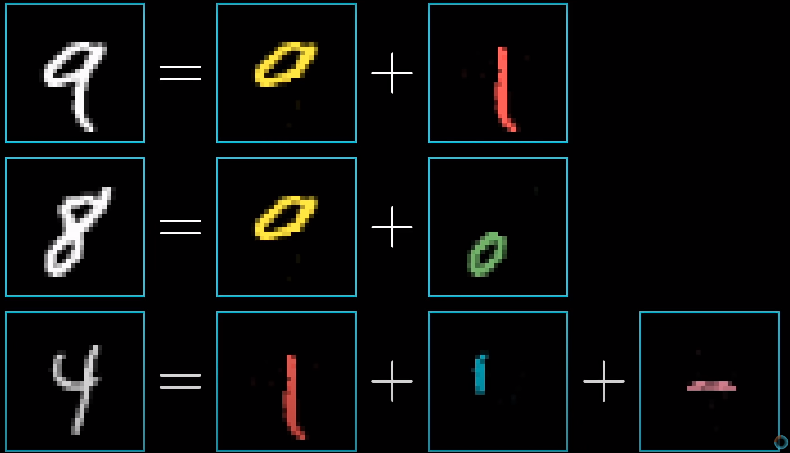
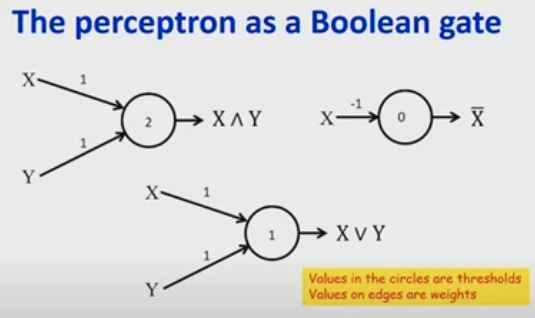

# Чему научимся
1. Что такое нейрон
2. Как картинки представляются в цифровом виде
3. В чем суть искуственного ителлекта
4. Формула нейросети, веса и отклонения
5. Универсальная теорема аппроксимации

## Что такое нейрон
Для начала представьте, что нейрон это сущность, которая содержит число. Для удобства предположим, что это число лежит в пределах от 0 до 1. Давайте рассмотрим изображение из датасета MNIST размерами 28х28. На нем мы видим цифры, которые показывают интенсивность оттенка серого, где 0 это черный цвет, а 1 белый. Всего для данного изображение мы имеем 28х28 = 784 пикселя. Вектор размером 784 и будем размером входа для нашей нейросети.    

Расмотрим нейронную сеть, показанную ниже не вдаваясь в детали ее архитектуры. На последнем слое мы видим вектор размера 10, который для каждой конкретной картинки в конечном итоге показывает степень уверенности по каждой из цифр. Также мы видим по середине два скрытых слоя (т.н. Hidden layers) с длинами по 16. На самом деле размер и количество скрытых слоев являются результатом произведенных многочисленных экспериментов и для каждой конкретной задачи это число адаптируется.

Каждый слой получает на вход вектор с активациями с предыдущего слоя. В конечном итоге, если у нас обученная сеть, то каждый слой будет активировать нужный паттерн, который в конечном итоге активирует корректный ответ на последнем слое.  

## Что за интеллект?
Почему вообще мы ожидаем от такого рода графа то, что он будет работать как "интеллект". Когда человек видит картинку, он опирается на различные паттерны. Набор найденных паттернов будет характеризовать результат. Например, как мы видим на изображении ниже, цифра "9" состоит из "кольца" и "палочки", цифра "8" из двух "колец", а цифра "4" состоит из "палочки", "палочки" поменьше и "горизонтальной черты"

Задача слоев состоит в том, чтобы выделить данные паттерны (т.н. features). 

## Weights and biases

Давайте посчитаем сколько всего весов и отклонений мы имеем для данной конфигурации. 

1. (28*28) * 16 + 16 для первого слоя
2. 16 * 16 + 16 для второго
3. 16 * 10 + 10 для третьего

Итого 13002 весов и сдвигов определяют нашу нейросеть. Процесс обучения состоит в том, чтобы найти нужные веса. Конечно вручную сидеть и выставлять веса является не самым увлекательным занятием.

## Формула
Многим знакома формула f=g(Wx + b). Давайте ее рассмотрим подробнее. 

На нашем же примере входные данные размера 784, должны получить вектор размерности 16 для второго слоя. 

Получается, что матрица W имеет размер 16x784, а размерность матрицы x 784x1.

Каждая строчка матрицы W показывает как надо умножать значения предыдущего слоя, чтобы при сумме получить нужную активацию. 

В конце добавляется еще отклонение и на результат накидывается функция активации. Например, Sigmoid, чтобы отобразить результат на (0, 1)

Отступление: на сегодняшний день редко можно встретить Sigmoid как функцию активации в промежуточных слоях. Причиной является более медленное обучение, а также для глубоких сетей значения на последних слоях получались слишком маленькие. Сейчас чаще можно увидеть ReLU и другие его модификации, такие как LeakyReLU, PReLU итд

Sigmoid применяется чаще на последнем слое, чтобы интерпретировать результаты выходного слоя как вероятности.

## Универсальная теорема аппроксимации
Теорема: Искусственная нейронная сеть прямой связи с одним скрытым слоем может аппроксимировать любую непрерывную функцию многих переменных с любой точностью.

Давайте разберем эту теорему. Начнем с того, что означает формулировка аппроксимировать непрерывную функцию многих переменных с любой точностью. Непрерывную функцию можно представить в виде дискретной

Существует интерактивный [сайт](http://neuralnetworksanddeeplearning.com/chap4.html) где это дело самим опробовать.

Все сходится к тому, что мы разбиваем нашу функцию на дискретные столбцы, которые пытаемся с помощью булевых функций описать.

Для того, чтобы описать булеву функцию нам надо ввести логические И, ИЛИ и НЕ. На изображении они описаны. На вход подаются 2 булевых переменных X, Y, которые перемножаются на веса, указанные над стрелкой. После применяем порог по значению, указанному в круге. 

Выразив функцию в дизъюнктивной нормальной форме, мы получим выражение, которое содержит операции И, ИЛИ и НЕ. Значит и можем выразить любую функцию с помощью одного скрытого слоя.

Можно ли аппроксимировать функцию не используя скрытые слои. Нет, функцию XOR нельзя аппроксимировать таким образом, требуется 1 скрытый слой.

