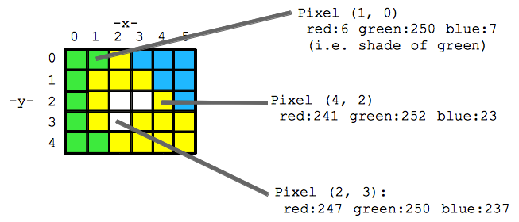

# Чему научимся
1. Как цветные картинки представляются в цифровом виде
2. Какие задачи бывают
3. Что такое конволюция и конволюционные нейронные сети
4. Типы моделей и чем они отличаются
5. Типы атак

## Цветные картинки
Существуют различные типы кодировок цветных изображений. Чаще всего используется 3-канальный RGB. Каждое изображение представлена 3 матрицами , в каждой из этих матриц проставлены интенсивности пикселей по соответствующему каналу.

## Какие задачи решаются по изображениям

- Классификация
- Детекция
- Сегментация
- Генерация

Хороший список по наиболее популярным задачам и их лучшим подходам существует [здесь](https://paperswithcode.com/area/computer-vision)

## Зачем нам нужны конволюции

